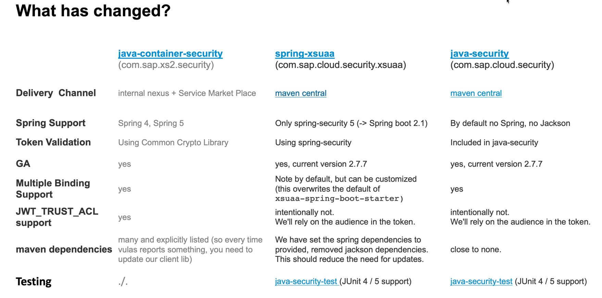

# Exercise 4 Migrate java-container-security library

The java-container-security` client depends on [Spring Security OAuth](https://projects.spring.io/spring-security-oauth), which has been put to maintenance with Spring 5. [Similar functionality](https://spring.io/projects/spring-security-oauth) is now integrated in Spring Security ([communication from 2018](https://spring.io/blog/2018/01/30/next-generation-oauth-2-0-support-with-spring-security): "After Spring Security has reached feature parity with Spring Security OAuth, we will continue to support bugs and security fixes for at least one year.")

This provides an overview about the different Java client libraries and the migration guides.
You need to select one.

## Exercise 2.1.1 Select Migration Guide

### Migration Guide for Spring Boot applications
Recommended replacement for Spring 5 based applications is [spring-xsuaa](https://github.com/SAP/cloud-security-xsuaa-integration#token-validation-for-java-spring-boot-web-applications).

Please follow this [Migration Guide](
https://github.com/SAP/cloud-security-xsuaa-integration/blob/master/spring-xsuaa/Migration_JavaContainerSecurityProjects.md).

### Migration Guide for (XSA) web applications using Spring-Security with less migration effort
If you like to have a smooth migration experience, and like to stick to the Spring Security OAuth (deprecated) you can follow this [Migration Guide](https://github.com/SAP/cloud-security-xsuaa-integration/blob/master/java-security/Migration_SpringSecurityProjects.md).

### Recommended replacement for native Java applications
Recommended replacement for Java native applications is [java-security](https://github.com/SAP/cloud-security-xsuaa-integration).

### Recommended replacement for J2EE applications
For J2EE applications the recommended replacement would be the SAP Java Buildpack` / `XSA Java Buildpack` that integrates Servlet Security into the tomcat server as described [here](https://github.com/SAP/cloud-security-xsuaa-integration#token-validation-for-java-web-applications-using-sap-java-buildpack).

## Summary

You've successfully removed the dependency to the SAP internal *container-security api for Java*, which is deprecated and you have successfully replaced it with the open-source security client libary, which is available on maven central.

Continue to - [SAP_JWT_TRUST_ACL](../sap_jwt_trust_acl/README.md)
